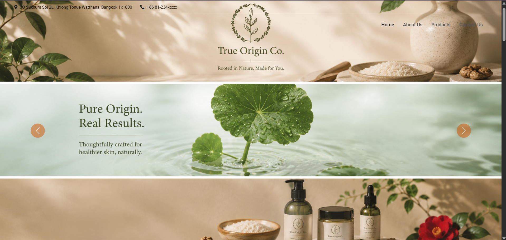
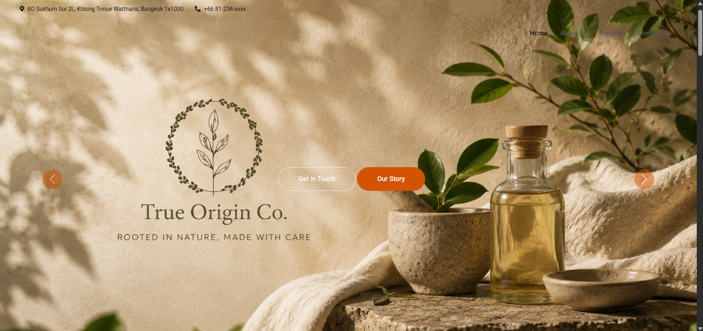
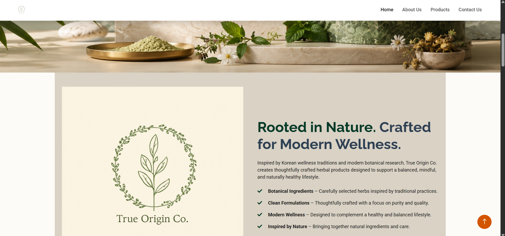
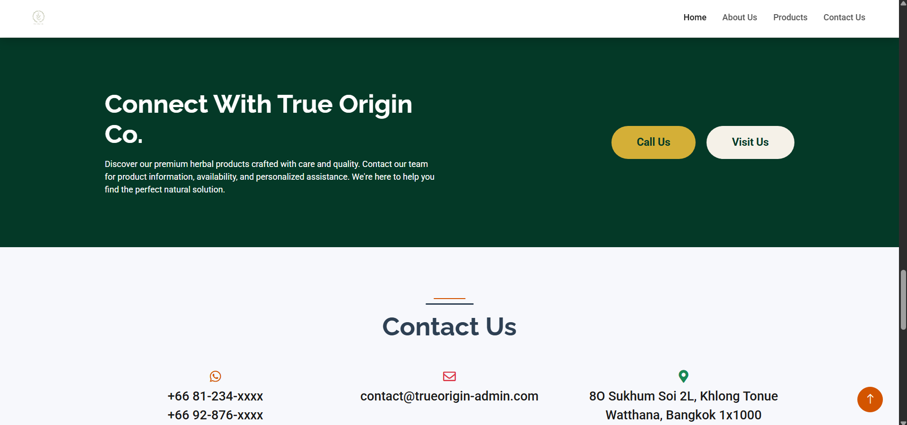
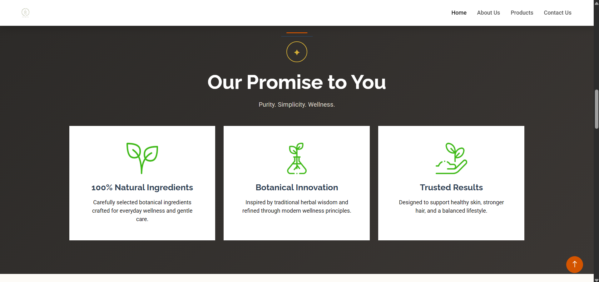
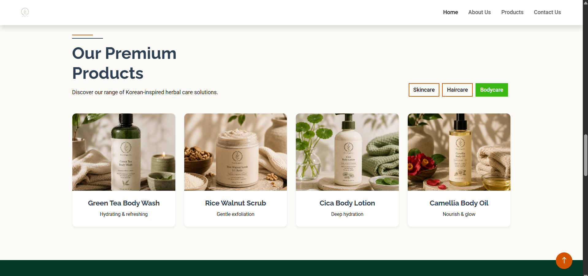
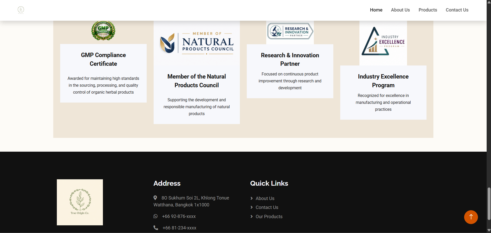

# 🌿 True Origin Co.


### Corporate-Style Herbal Product Showcase Website


A professional herbal product showcase website developed using ASP.NET MVC, C#, and MySQL. The project demonstrates modern web development practices through a responsive and visually appealing platform featuring product presentation, company branding, certifications, and customer engagement sections.


---


## 🚀 Features


### 🌱 Product Showcase

- Herbal product catalog presentation

- Product information sections

- Premium product-focused UI


### 🏢 Company Profile

- Brand story and company overview

- Mission and values presentation

- Corporate-style website structure


### 🏆 Certifications \& Recognition

- Industry certification display

- Quality assurance badges

- Professional trust-building elements


### 📞 Contact \& Engagement

- Contact information section

- Location and accessibility details

- Customer inquiry support


### 📱 Responsive Design

- Mobile-friendly interface

- Modern UI/UX design

- Optimized user experience


---


## 🛠️ Technology Stack


Category | Technology 


 Framework | ASP.NET MVC 

 Language | C# 

 Database | MySQL 

 Frontend | HTML5, CSS3, Bootstrap 

 Scripting | JavaScript, jQuery 

 Version Control | Git \& GitHub 


---


## 📂 Project Structure


```text

TrueOriginCo

│

├── Controllers

├── Models

├── Views

├── Content

├── Scripts

├── App\_Start

├── Properties

└── Web.config

```


---


## 🎯 Key Highlights


- Corporate-style herbal wellness website

- Responsive and user-friendly design

- Product showcase and branding platform

- MVC architecture implementation

- Professional UI customization

- Git and GitHub version control


---


## 🔮 Future Enhancements


- Admin Dashboard

- Product Management System

- Authentication \& Authorization

- Customer Inquiry Module

- Product Search \& Filtering


---


## 📸 Project Gallery


















## 👨‍💻 Author


Developed as a Web development project to demonstrate practical implementation of ASP.NET MVC, C#, and MySQL in a corporate-style product showcase platform.

